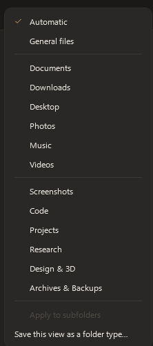
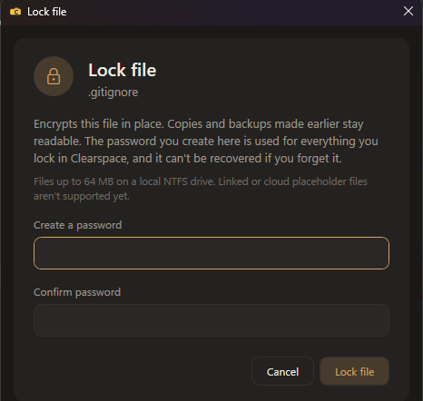
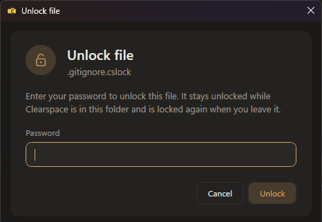
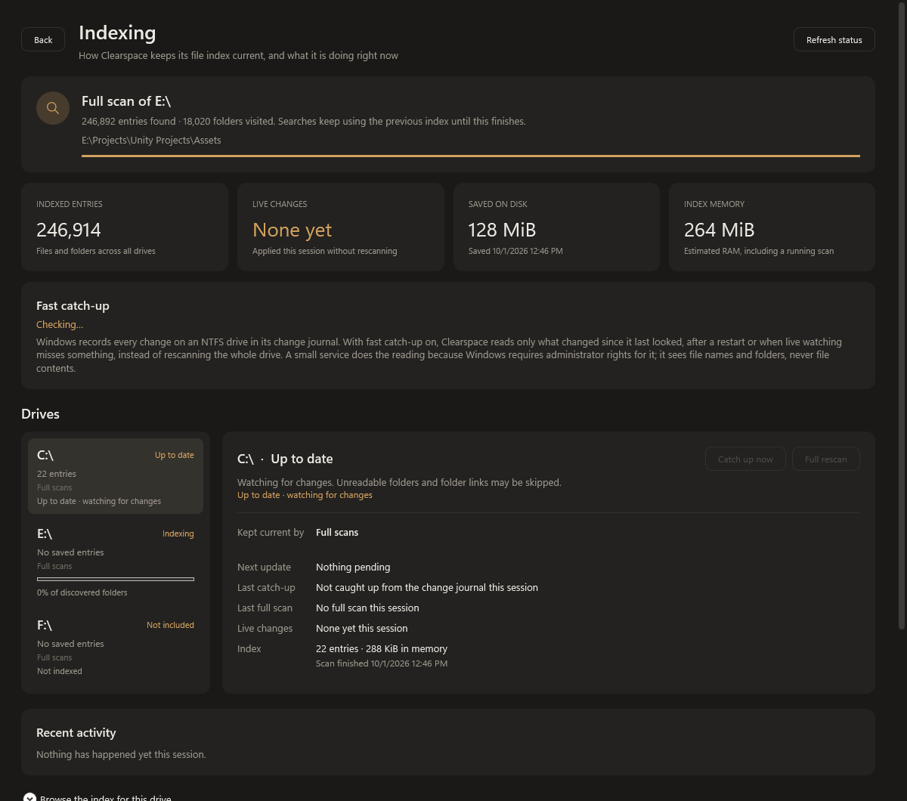
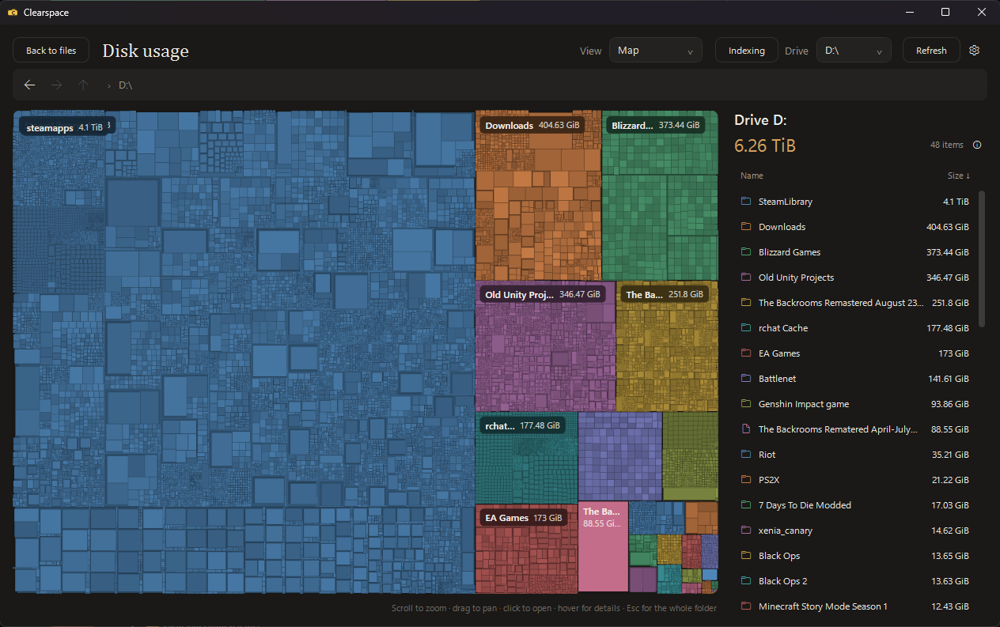
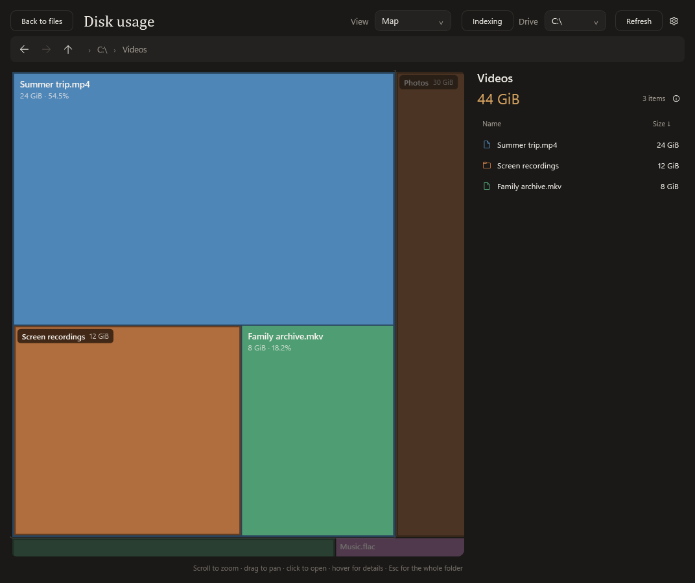
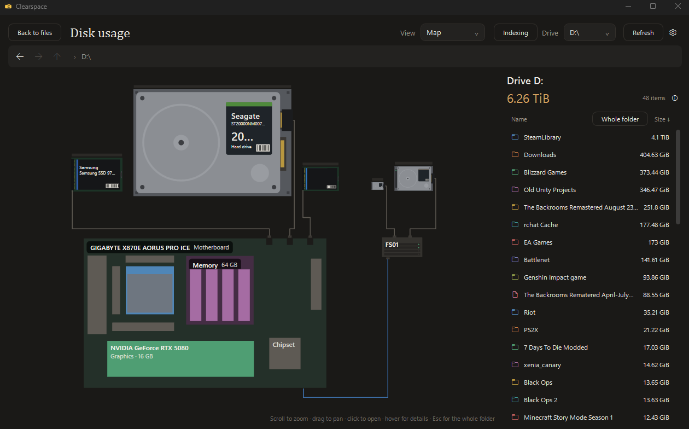
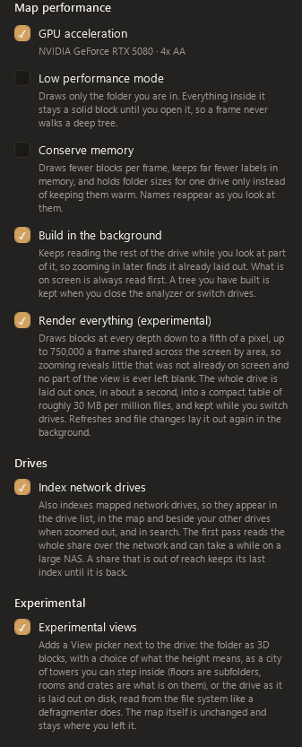

# Clearspace

Clearspace is a modern Windows file manager built to be a comfortable replacement for File Explorer: familiar file operations, a calmer interface, and better ways to organize and find work.

> **Work in progress:** Clearspace 1.0.0 is an early public release. There will be bugs and rough edges as it is used on more Windows setups and file collections. Please report issues you find; fixes and improvements will continue over time.

<!-- NEW: a short list of the recent additions, linking to the sections below. -->
## What's new

- **[Password locks](#password-protected-files-and-folders)** for files and folders, with lock icons and right-click entries in Windows Explorer too.
- **[Folder types](#folder-types-that-adapt-to-your-work)**: thirteen built-in types, types you save yourself, a Projects strip, and Git status in Code folders.
- **[Instant indexing and fast catch-up](#instant-indexing-and-fast-catch-up)**: a drive's first index takes seconds, and reopening Clearspace reads only what changed.
- **[The Indexing page](#see-what-is-indexed)** shows how each drive is kept current and what the index is doing right now.
- **[Disk usage map](#disk-usage-visualizer)**: your drives, motherboard, memory and processor when you zoom out, plus experimental 3D views.
- **Lower memory use**: saving the index no longer copies it, and memory used by a rescan is handed back to Windows.

## What Clearspace adds

### Folder types that adapt to your work

<!-- CHANGED: every folder type explained in one table (what it opens as, what it adds, and when
     Automatic picks it), with a picture of the menu. -->

Every folder has a type, chosen from the folder type button in the toolbar. The
type decides how the folder opens (tiles or a list), which columns it shows, how
it is sorted and grouped, and which extras it gets, such as the photo viewer or
the music player. A type you choose is saved for that folder.



Leave a folder on **Automatic** and Clearspace picks the type for you. The
toolbar shows what it picked, for example **Auto (Photos)**, or just **Auto**
when nothing in particular fits and the folder opens as General files. It
decides in this order:

1. **Windows' own folders.** Desktop, Documents, Downloads, Pictures, Music,
   Videos and Pictures\Screenshots keep their meaning wherever they have been
   moved to.
2. **The folder's name.** A folder called "Camera roll" opens as Photos, "Old
   backups" as Archives & Backups, and so on.
3. **A code repository.** A `.git` folder, a solution or project file, or a
   package manifest such as `package.json` in the folder or any folder above it.
4. **What the folder contains.** Once a folder has been opened, at least three
   files with most of them (60 %) of one kind decide it: mostly pictures is
   Photos, mostly songs is Music.

**Apply to subfolders** makes the type you chose cover every folder inside it,
unless one of them has a type of its own; the nearest choice wins. Code,
Projects, Research and Archives & Backups apply to subfolders as soon as you
choose them.

<br clear="right">

What each type does:

| Type | Opens as | What it adds | Automatic picks it for |
| --- | --- | --- | --- |
| **General files** | List: name, date modified, type | Nothing extra: a plain, fast list. Cloud folders also show each file's sync status. | Anything no other type fits |
| **Documents** | List: name, pages, authors, date modified, type, size | Page counts and authors, read from the files themselves. | Windows' Documents folder; folders of mostly PDFs, Office files, text and e-books |
| **Downloads** | List: name, source, date modified, type, size | Newest first, grouped by day, with the site each file came from. | Windows' Downloads folder; names containing "downloads" |
| **Desktop** | List: name, type, date modified, size | Folders, shortcuts and files in their own groups. | Windows' Desktop folder |
| **Photos** | Picture tiles | The in-app photo viewer (zoom, rotate, crop), and image dimensions in details view. | Windows' Pictures folder; names like photos, pictures, images, camera roll, wallpapers; folders of mostly pictures |
| **Music** | List: play, name, artist, album, length, date modified | Track details read from the files, and the built-in music player. | Windows' Music folder; names like music, songs, albums, playlists; folders of mostly audio |
| **Videos** | Video tiles | Each tile shows the video's length; details view adds length and resolution. | Windows' Videos folder; names like videos, movies, clips, recordings; folders of mostly videos |
| **Screenshots** | Picture tiles | Everything Photos does, newest first, and grouped under Today, Yesterday, This week… in details view. | Pictures\Screenshots; names like screenshots, screen captures, snips; pictures mostly named "Screenshot…", "Capture…" or "Snip…" |
| **Code** | List: name, Git, date modified, type, size | The Git branch and how many files have changed, a Git column with each file's status, and build and dependency folders such as `bin`, `obj` and `node_modules` dimmed. | A code repository at or above the folder |
| **Projects** | List: name, date modified, type, tags | A strip above the list with files you pinned to the project and the files changed most recently anywhere inside it. Right-click a file and choose **Pin to project**. | Never; choose it yourself |
| **Research** | List: name, title, authors, pages, date modified | Papers by their real title and authors (so `2304.12345.pdf` reads as a paper), most recent first. PDFs are read by Clearspace itself, since Windows has no PDF property reader. | Names like research, papers, literature, readings, thesis |
| **Design & 3D** | Large tiles (160 %) | Large previews (3D models too, where Windows can draw them), the photo viewer, and pixel sizes. | Names like design, renders, artwork, 3D models, Blender; folders of design files (PSD, AI, SVG, Blender, STL, OBJ, FBX…) kept with their pictures |
| **Archives & Backups** | List: name, date modified, date created, size, type | Newest first and grouped by date, and their contents rank below your current files in search. | Names containing "backup" or "archive"; folders of mostly archives (ZIP, 7z, RAR, ISO, BAK…) |

Columns, sorting, layout and tile size can still be changed in any folder; the
type only sets where it starts.

Arrange a folder the way you like it and choose **Save this view as a folder type…** to keep its layout, columns, sort and tile size as your own type (for example "School"). A saved type keeps the extras of the type it was made from, so one saved from Photos still has the photo viewer. Search understands folder types too: `screenshots receipt` or `type:school essay`.

Select several folders, right-click, and set their type together when organizing a larger collection.

### Built-in music player

Set a directory to **Music** and Clearspace can play supported tracks directly in the app. It reads the same Windows music properties used by Explorer for metadata such as artist, album, track number, and duration, while keeping ordinary double-click behavior available for opening files in their default app.

### Tags and Favorites

Tags are lightweight labels you can create and apply to one or many selected files and folders. They make it possible to group work across unrelated locations without moving anything on disk.

- Create, apply, remove, and delete tags from the right-click menu.
- Search by a tag name, or use `tag:work` for an exact tag filter.
- Pin frequently used locations to Favorites in the sidebar.
- Organize pinned locations into your own collapsible, reorderable categories.

Tags are saved in `%APPDATA%\Clearspace\tags.db` using SQLite. On the first run,
existing `tags.json` data is imported automatically and the original file is kept.
Bulk changes save together, and failed writes leave the previous assignments intact.
See [Artifact 3 database notes](docs/CS499-Artifact-Three-Databases.md) for migration,
backup, and recovery details.

### Password protected files and folders

<!-- CHANGED: same behavior as before, regrouped under short labels so it is easier to scan. -->

Right-click a file or folder and choose **Lock with password…** to encrypt its
contents. The first lock creates a master password (any length); later locks use
that password. Keep the password safe: it cannot be recovered. Existing copies and
backups are not encrypted by this operation.

<!-- NEW: pictures of the lock and unlock dialogs. -->
<p>
  
  
</p>

*Left: the first lock creates your password. Right: unlocking a locked file.*

- **Files.** A locked file is renamed `<name>.cslock` and shows a lock badge.
  Opening it, or choosing **Unlock…**, asks for the password and restores it. It
  stays unlocked until no Clearspace or Explorer window is showing its folder,
  then locks again.
- **Folders.** Locking a folder encrypts every file inside it and its subfolders;
  names stay visible. Opening a locked folder asks for the password. While you're
  inside, its files are unlocked and work normally, and Clearspace locks them
  again when you leave (or on the next start after a crash).
- **In Windows Explorer.** The same actions are in Explorer's right-click menu,
  and locked items get lock icons there too. See
  [Using locks from Windows Explorer](#using-locks-from-windows-explorer) below.
- **Removing locks.** **Remove lock…** decrypts for good and works on several
  selected files and folders at once. Removing the lock from something inside a
  locked folder also stops that folder asking for a password (its other files
  stay locked). **Settings > Remove all locks and reset password…** unlocks
  everything and lets you create a new password on the next lock.
- **Reinstalls and other PCs.** Locked files never depend on Clearspace's
  database: after a reinstall, a Windows reset or on another PC they still open
  with the password they were locked with. If that is an older password, the
  prompt says so and offers to switch the file to your current one;
  **Change password…** does the same for a selection.
- **Limits.** Locking works on local NTFS drives. Files that can't be locked
  (over 64 MB, links, cloud placeholders, files with additional data streams
  such as downloads, files in use) are skipped and listed. Drive roots, your
  user folder, and Windows/program folders are refused.

<!-- PICTURE SLOT (uncomment once the file exists):

-->

Lock metadata and the password verifier are stored in SQLite; each encrypted
file also contains protected recovery metadata. See [file-locking notes](docs/CS499-File-Locking.md)
for the format, tests, and recovery limitations.

<!-- NEW: how locking works in File Explorer, without opening Clearspace. -->
#### Using locks from Windows Explorer

You don't need the Clearspace window open to use locks. Setup, and every start
of Clearspace, adds Clearspace's entries to Explorer's right-click menu (under
**Show more options** on Windows 11). Explorer also shows locked items with
their own icons: a locked file appears as `<name>.cslock` with a lock icon and
the type "Clearspace locked file", and a locked folder gets a lock folder icon.

<!-- PICTURE SLOT (uncomment once the file exists):

-->

| In Explorer | What happens |
| --- | --- |
| Right-click a file, **Lock with Clearspace** | The password dialog opens on its own. The file is encrypted in place and renamed `<name>.cslock`. |
| Double-click a `.cslock` file | Asks for the password, unlocks the file, and opens it in its usual program. |
| Right-click a `.cslock` file, **Unlock with Clearspace** | Unlocks it for now, without opening it. |
| Right-click a `.cslock` file, **Remove lock with Clearspace** | Decrypts it for good. |
| Right-click a `.cslock` file, **Change password with Clearspace** | Switches a file locked with an older password to your current one. |
| Right-click a folder, **Clearspace**, then **Lock folder**, **Unlock folder**, **Remove lock** or **Change password** | The same actions for every file inside the folder and its subfolders. |
| Right-click a folder, **Clearspace**, **Open in Clearspace** | Opens the folder in the main Clearspace window. This is the only entry that does; all the others show just the password dialog. |

Unlocking is for a visit, not for good. An unlocked file goes back to its normal
name and works in any program. Meanwhile Clearspace keeps running in the
background with no window and watches which folders your Explorer windows and
tabs are showing:

- A few seconds after no Explorer or Clearspace window is showing that folder,
  the file is encrypted again. Clearspace exits once nothing is left unlocked.
- If you unlock a folder from its right-click menu and don't open it within a
  minute, it locks again.
- A file another program still has open is retried every 30 seconds.
- Anything left unlocked by a crash or a shutdown is locked again the next time
  Clearspace starts.

A file inside a locked folder is unlocked by unlocking the folder: one password
prompt covers everything in it.

One difference from Clearspace itself: Explorer can still open a locked folder
and list what is in it without a password. What it lists are the encrypted
`.cslock` files, so nothing in them can be read until you unlock. Only
Clearspace's own window stops at the folder and asks for the password first.

### Photo viewer and editing

The Photos folder type has an in-app image viewer. Open an image from its tile to browse the folder, zoom, and pan without leaving Clearspace. You can also rotate an image or crop a selected region directly in the viewer, saving in place when the format supports it or saving a copy when needed.

### Search designed to stay responsive

Clearspace treats search as a layered operation instead of making the interface wait for a complete disk walk:

1. Filtering the folder already on screen happens immediately from its in-memory snapshot.
2. Search then walks subfolders in the background and streams additional matches into the results rather than freezing the window.
3. When enabled, Clearspace also asks the existing **Windows Search index** for fast results from indexed locations—including supported text inside documents—while the background walk continues to cover locations Windows has not indexed.

The result is a faster first response, plus complete results rather than a choice between speed and coverage. **Search Everywhere** expands the search to ready local drives and Clearspace's saved tag/folder-type indexes. Network drives are intentionally not crawled as part of that wide search, because an unavailable share should not make search feel stalled.

Useful search filters:

```text
tag:work           items with the Work tag
type:photos        folders set to the Photos type
ext:png            PNG files
is:folder          folders only
is:image           image files only
```

Clearspace maintains a compact filename index and also uses the Windows-maintained index for file contents. Content results depend on Windows indexing the location and having an IFilter for that file type. If a source is unavailable or lacks coverage, Clearspace can fall back to its background crawl.

<!-- NEW: the index helper service, file-table scan and change-journal catch-up. -->
### Instant indexing and fast catch-up

Clearspace keeps its own index of file names, sizes and dates, so search and the
disk map never wait on a walk of the disk. A small optional Windows service, the
**Clearspace Index Helper**, makes that index quick to build and cheap to keep
current:

- **Instant first index.** Instead of opening every folder, the helper reads the
  drive's NTFS file table front to back. A few million files take seconds rather
  than minutes. The first time this is used on a drive, Clearspace compares it
  once, in the background, with a normal folder walk; if the two disagree, that
  drive goes back to folder walks and the Indexing page says why.
- **Fast catch-up.** Windows records every change on an NTFS drive in its change
  journal. After a restart, or when live watching misses something, Clearspace
  reads only what changed since it last looked instead of rescanning the whole
  drive. Drives kept current this way skip the daily rescan.

Turn it on with **Instant indexing** in the installer, or later with **Turn on**
under *Fast catch-up* on the Indexing page; Windows asks for administrator
permission once. **Turn off** removes the service again. Clearspace itself always
runs as a normal user. The helper sees file names and folders, never file
contents, and only returns paths your own account can open.

Without the helper, and on network drives or drives that are not NTFS, Clearspace
walks folders as before: live changes are applied as they happen and the drive is
rescanned once a day.

The index is held in memory while Clearspace runs, roughly 100 MB per million
files and folders. Saving it writes straight to disk without making a second
copy, and the memory a rescan needs is handed back to Windows when it finishes.

### See what is indexed

<!-- CHANGED: describes the current Indexing page (fast catch-up, per-drive facts, activity log). -->

Open **Indexing** from the file browser toolbar, the disk viewer toolbar, or the
index status indicator. This page stays inside Clearspace.



*The Indexing page, drawn here with sample data.*

It shows:

- What the index is doing right now: the drive and folder being scanned, with
  live entry and folder counts. Searches keep using the previous index until a
  scan finishes.
- Totals: indexed entries, live changes applied this session, the saved index's
  size on disk and when it was saved, and an estimated memory footprint, listed
  separately from disk space.
- **Fast catch-up**: whether it is on, with **Turn on** and **Turn off**.
- Each drive's status and how it is kept current (the change journal or full
  scans), its next update and why one is pending, its last catch-up, its last
  full scan, and the live changes applied this session.
- During a scan, per-drive progress bars show the percentage of discovered folders processed,
  with processed and waiting counts. More folders are discovered during scanning,
  so the percentage can decrease. Completed drives show a ready status instead of
  an idle progress bar. Excluded or unreadable locations remain listed separately.
  No extra counting scan is required.
- **Catch up now** reads only what changed since the last look. **Full rescan**
  requests a complete scan on the existing background worker; current saved
  entries stay searchable while it runs. Automatic full rescans are spaced 20
  minutes apart, and **Full rescan** skips that wait. **Refresh status** only
  refreshes the display.
- **Recent activity**: a log of this session's scans, catch-ups and problems.
- **Scan coverage and skipped folders**: skipped folders and reasons from the
  latest scan in this session. Older saved indexes clearly indicate when those
  details are unavailable.
- **Index file**: the saved index's full storage path, with buttons to copy the
  path or open the containing folder.

**Browse the index for this drive** supports folder navigation, filtering, and pages of up to 1,000
entries so large folders do not create enormous interface lists. Index reads run
in the background. Clearspace indexes names, paths, sizes, and file metadata;
document-content indexing belongs to Windows Search, whose options are linked
from the page. Use **Back** to return to the view you were using.

### Disk usage visualizer

Use **Disk usage** in the toolbar or right-click menu to explore indexed file
sizes. Folder tiles show their combined file sizes; click one to drill down,
or compare sizes and matching colored icons in the compact list. Use
your mouse's side buttons for Back/Forward through visited folders and drives.
The view also includes breadcrumbs, Up, drive selection, and Refresh.
It displays a snapshot of logical file lengths, so recent
changes and folders excluded by the index scan may be missing. Refresh reads
the latest available index rather than starting a new scan.

<!-- NEW: pictures. -->


*A 6 TiB drive with **Render everything** on: every block at every depth is drawn at once.*

The analyzer opens inside Clearspace; **Back to files** restores the browser.
The whole drive is one nested treemap that fills the space beside the list, and
the view is a camera moving over it. Click a block to fly into it: the folder
grows out of the exact rectangle you clicked, its contents fade in as they
get room, and the rest of the drive stays in place, dimmed, around it. Scroll to
zoom smoothly at the pointer, drag to pan, and zoom back out to leave a folder;
the list, breadcrumbs, and history follow along. Back, Up, breadcrumbs and your
mouse's side buttons fly the same camera, so every transition is continuous.
Escape (or **Whole folder**) returns to the full current folder after zooming inside it.



*Inside a folder (sample data): the rest of the drive stays in place, dimmed, around it.*

Keep zooming out past the whole drive's files and the rest of the drive comes into
view at the same scale: its free space, and used space the index does not account
for. Zoom out further still and the other drives in the drive list appear in a row
beside it, each sized to its capacity, with a name plate on top and a cable running
down to your computer below them. Indexed drives show their own folders and files,
laid out like the map; drives not indexed yet show used and free space. Zoom into
another drive and it opens once its files fill the view, or click it (or one of its
folders) to fly in and open it there. The drives keep their places in drive-letter
order whichever one is open. Click anywhere else out there to return to the files.

Each drive is drawn as the device it is - an M.2 NVMe stick with its gold contacts,
a 2.5" SATA SSD, a 3.5" hard drive with its connectors, a USB enclosure - read from
Windows' own description of the disk. Zoomed all the way out, each one's cover fades
in: a hard drive's lid with its platter and label, an SSD's or NVMe stick's label,
all showing the maker, model and capacity. Zooming into a drive opens its cover up
again to show the files inside. Network drives sit on a server of their own, named
after it and cabled to your computer.

Zooming out stops once at the row of drives on their own; a few more pushes of the
wheel carry on out to your actual motherboard below them, each drive cabled down into
a SATA port on its edge. The board is drawn the way the map draws everything - flat
blocks with the map's gaps and labels: the board tagged with its maker and model, the
processor, a memory block holding its slots (a module in each one that is really
filled, labelled with its size), and the graphics card, all named from the machine
itself. Network drives sit on their servers beside it, cabled to the board. Hover a
part for its details.



*Zoomed all the way out: the drives, the motherboard with its processor, memory and graphics card, and a network share on its server.*

Zoom into the memory and its sticks fade away to show what it holds, laid out like a
drive: every running program sized by the memory it takes (all its processes
together), then Windows' own share, what is available, and what the hardware
reserves. Zoom into a program and you see what it has loaded - its .exe, its
libraries, data files it has mapped - each sized by how much of it is actually in
memory, beside its own working data. Click any block to zoom to it. It updates live,
once a second, but only while you are looking into the memory (its contents on screen
and the window not minimized) - anywhere else nothing is read or redrawn. Blocks grow
and shrink in place as programs use more or less memory, rather than reshuffling. It
needs no administrator rights; a few system programs Windows keeps
closed to other programs show only their size. Memory is not stored per stick
(Windows spreads every program across all of them), so the programs fill the memory
as a whole.

Zoom into the processor and its lid fades away to show the die, laid out as your chip
is actually built - read from Windows, not a stock picture: its core complexes (one
per L3 cache, so a Ryzen shows its CCXs), the cores in them with their threads and
their own L1 and L2 caches, performance and efficiency cores on hybrid Intel chips
(efficiency cores in the fours that share an L2), and the L3 each complex shares.
Every core and thread is lit from cool to warm by how busy it is, with its clock
speed in its details. Beside the die, What's running shows every program sized by
its share of the processor. Like the memory, it updates once a second only while you
are looking into it, and needs no administrator rights (temperatures would need a
driver, so they are not shown). It is drawn as the chip is organised, not to scale.

**Index network drives** (in the same gear panel, off by default) indexes mapped
network drives too, so a NAS or share appears in the drive list, in the map, beside
your other drives when zoomed out, and in search. Clearspace only reads a share while
it answers - reachability is checked in the background once a minute, never on the
UI thread - and a share that is out of reach keeps its last index so its sizes can
still be browsed. The first pass reads the whole share over the network, so a large
NAS can take a while. Turning the option off drops those indexes straight away.

Blocks take one hue per branch - everything inside a top-level folder shares its
color - and each block within it gets its own shade, so a folder reads as one
region without its contents fusing into a flat field. List rows use the same
colors. Hover a block for its size, share, file type, and what a click will do. Tile areas are
exact byte proportions within each folder. Deeper folders load in the background
as they grow on screen, and very large folders group their smallest items so
drawing stays fast at any zoom.

A folder tree you have explored is kept when you close the analyzer or switch to
another drive, so coming back is immediate and keeps the depth you had opened.
With **Build in the background** on (the default), Clearspace keeps reading the rest
of the drive while you look at part of it, so zooming in later finds it already laid
out. What is on screen is always read first.

With **Render everything** on, the whole drive is laid out once when the analyzer
opens - about a second for a million files - into a compact table of roughly
30 MB per million files, so every block at every depth is on screen immediately
and zooming never waits for anything to load. The layout is kept when you switch
drives, and refreshes and file changes (up to six levels below the folder you are
in) lay it out again in the background and swap it in when it is ready.
Folder sizes are aggregated once and kept warm, so opening the analyzer shows the
map immediately instead of calculating first. They are recomputed when you choose
**Refresh** or when a full index build finishes; while the view is open it also
updates itself quietly in the background. Changing drives, resizing, and first
load cross-fade from the picture already on screen rather than blanking.

<!-- CHANGED: the map's settings as they appear in the gear panel, with a picture. -->
The gear beside Refresh opens the map's settings. All of them are remembered
between runs.



**Map performance**

- *GPU acceleration* draws the blocks through Direct3D; turning it off uses the
  built-in multi-threaded CPU rasterizer, which is what runs anyway on a machine
  with no usable Direct3D adapter. The panel names the adapter in use.
- *Low performance mode* draws only the folder you are in - everything inside it
  stays a solid block until you open it - so a frame never walks a deep tree.
  That is the setting to reach for on integrated graphics or in enormous folders.
- *Conserve memory* draws fewer blocks per frame, keeps far fewer labels in
  memory, and holds folder sizes for one drive only instead of keeping them
  warm. Names reappear as you look at them.
- *Build in the background* keeps reading the rest of the drive while you look
  at part of it, so zooming in later finds it already laid out.
- *Render everything (experimental)* draws blocks at every depth, down to a
  fifth of a pixel and up to 750,000 a frame, so zooming reveals little that was
  not already on screen and nothing pops in. The drawing itself is nearly free
  on a discrete card; the cost is that the whole folder must be read and held in
  memory, so watch the F3 memory line in a very large folder.

**Drives**

- *Index network drives* also indexes mapped network drives, as described above.

**Experimental**

- *Experimental views* adds the **View** picker described below.

<br clear="right">

**Experimental views** (also in the gear panel, off by default) add a **View** picker
beside the drive list. The map itself is untouched: it is only hidden while another
view shows, keeps following navigation, and comes back exactly as you left it.
*3D blocks* raises the folder you are in as a field of blocks on the map's own
layout - orbit with a drag, pan with a right-drag, scroll to zoom, double-click a
folder to open it. What the height means is chosen in the corner: *Stacked folders*
(every folder a slab with its contents standing on it), *size*, *file count*, or
*file types* (coloured by type, as tall as that type's share of the folder).
*Disk layout* shows where the largest files physically sit on the drive, read from
the file system the way a defragmenter reads it, as a spinning platter (cluster 0
at the rim, the end of the drive at the hub) or as a defragmenter-style grid. Items
in the current folder keep their list colours and everything else is grey; hover
for the file and how many pieces it is in, click to open it. Free space is shown
when Clearspace runs as administrator. On an SSD the positions are logical: the
drive decides where data physically lives.
<!-- NEW: the 3D city view. -->
*3D city* shows the folder you are in as a city. Every item is a building on the
map's own layout: folders are towers, files are low houses, and a tower's floors
are its subfolders, stacked largest at the bottom in their true proportions.
Click a tower to step inside: its floors pull apart and one slides out with its
contents laid out on it, subfolders as rooms and files as crates coloured by
type. The elevator panel, the arrow keys, or a click moves between floors.
Double-click a room (or press Enter) to make that folder the tower you are in;
Back, Up, breadcrumbs and the list follow along. Esc or Backspace steps back out
onto the street.

Initial layout, folder-path navigation, and detail loading run in the background.
The map batches tiles through the GPU (with a CPU fallback), limits work per frame,
and stops its animation loop when idle. Press **F3** in the analyzer to see frame
timings on your own drive. Closing the analyzer cancels its remaining work.
Map redraws yield to mouse and window input. Distant groups stay compact when
their fine detail would exceed the frame budget; zooming closer reveals their
contents at full pixel resolution.

Zoom detail fades gradually, and delayed GPU frames retain their matching labels
and hit targets. Background detail loading is limited during gestures; the sidebar
waits until zooming settles before replacing its listing.

The sidebar uses single-line name/size rows. Hover for full names and percentages;
the info button holds index details. Selection reveals the permanent-delete controls.

To **delete permanently**, right-click a file/folder block or select items in
the list and use the delete button or **Shift+Delete**. The confirmation lists
the targets and explains that they will bypass the Recycle Bin. Afterward, the
map and totals update for items confirmed removed, including partial deletions.

See [algorithm implementation notes](docs/CS499-Algorithms-Disk-Usage.md) for
design decisions, complexity, tests, and limitations.

## Familiar file-manager foundations

- Browse local, mapped network, and known Windows folders.
- Back, forward, up, breadcrumb navigation, side-mouse navigation, and an address bar.
- Copy, cut, paste, rename, new folder, delete to the Recycle Bin, and properties.
- Explorer-style right-click menus and Windows copy/conflict dialogs.
- This PC and Network hubs with drive capacity indicators.
- Per-folder details-column order and width, saved between sessions.
- Grid zoom is remembered independently for each folder.
- Optional terminal launch in the folder currently being viewed.

## Install or build

### Installable release

Run [Build Installer.cmd](Build%20Installer.cmd). It publishes a self-contained 64-bit build, then creates:

```text
release\ClearspaceSetup.exe
```

The setup is a normal Windows installer in Clearspace's dark look. It installs Clearspace for the current user, creates a Start Menu entry, and offers an optional desktop shortcut.

<!-- NEW: dependencies, update. -->
**Nothing else to install.** .NET, WPF and SQLite are built into `Clearspace.exe` (and into the index helper); everything else Clearspace uses is part of Windows 10 and 11. The setup file works offline and downloads nothing. The installer script refuses to build if the published app is not the self-contained one.

**Updating.** The version number comes from the [VERSION](VERSION) file: raise it, run `Build Installer.cmd` again, and run the new setup on a PC that already has Clearspace. Setup then opens on a page offering:

- **Update** (or **Repair** when the same version is installed) — replaces the app and keeps settings, tags, the saved index and locked files. Clearspace is closed first; anything unlocked for a visit is locked again before it closes.
- **Update and choose the options again** — the same, plus the page with the desktop shortcut and Instant indexing options.
- **Remove Clearspace** — starts the uninstaller.

A silent run (`ClearspaceSetup.exe /VERYSILENT`) performs the plain update.

<!-- NEW: in-app updates. -->
### Updates from inside Clearspace

Nobody has to download the installer by hand after the first install:

- **Settings > Check for updates…** looks for a newer release right away.
- **Settings > About Clearspace…** shows the version, where Clearspace and its data are, and the Windows and .NET it runs on, with the same **Check for updates** button and a **Copy details** button for bug reports.
- **Check for updates automatically** (in the About window, on by default) looks quietly a few seconds after Clearspace starts and every 6 hours while it is open. It never interrupts: a newer version shows as an **Update available** chip in the status bar.
- The update dialog shows what changed. **Update now** downloads the installer, checks it against the size and SHA-256 fingerprint GitHub lists for it, runs it with only a progress window, and opens Clearspace again. **Later** keeps the chip; **Skip this version** hides it until something newer is released.

The check is one request to GitHub's public API for the newest release of this repository; nothing else is sent. Turn **Check for updates automatically** off in the About window to stop it.

**Publishing an update:**

1. Raise the number in [VERSION](VERSION) (for example `1.3.0`).
2. Run `Build Installer.cmd`.
3. Create a GitHub release tagged `v1.3.0` — the tag must match `VERSION` — and attach `release\ClearspaceSetup.exe` under that exact file name. The release description is what the update dialog shows.

Copies of Clearspace older than 1.2.0 have no update check, so they need the 1.2.0 installer run once by hand.

<!-- NEW: the installer's indexing option. -->
Setup also offers **Instant indexing** (on by default), which installs the Clearspace Index Helper service described under [Instant indexing and fast catch-up](#instant-indexing-and-fast-catch-up). Windows asks for administrator permission once, during setup.

Building the installer requires the [.NET 10 SDK](https://dotnet.microsoft.com/download/dotnet/10.0) and [Inno Setup](https://jrsoftware.org/isdl.php) (`winget install -e --id JRSoftware.InnoSetup`). The dark look needs Inno Setup 6.6 or newer, and 6.7 or newer for Clearspace's exact background color; older versions still build, with a light installer. End users only need the generated setup file.

<!-- NEW: what uninstalling removes and what it leaves. -->
### Uninstall

Uninstall Clearspace from Windows Settings like any other app (or run the setup again and choose **Remove Clearspace**). This closes Clearspace and removes the app, its shortcuts, the Explorer right-click entries and `.cslock` file type, and the Index Helper service (Windows asks for permission once to remove the service).

<!-- CHANGED: the uninstaller now asks about locks and data instead of leaving both behind. -->
Before anything is removed, the uninstaller asks up to two questions:

1. **Locked files** (only when something is still locked): **Remove the locks first** opens Clearspace's *Remove all locks* dialog, which asks for your password and decrypts everything; **Leave them locked** uninstalls anyway. Files left locked open again after reinstalling Clearspace, with the same password.
2. **Your data**: **Keep my data** leaves tags, folder types and settings in `%APPDATA%\Clearspace` and the saved index, lock icons and logs in `%LOCALAPPDATA%\Clearspace` for a later install. **Remove everything** deletes both folders. If items are still locked, the lock records (`tags.db`) and lock icons are kept either way.

A silent uninstall asks nothing and leaves locks and data alone.

### Development build

Run [Build Clearspace.cmd](Build%20Clearspace.cmd) to publish a local executable to `dist\` and create a desktop shortcut. [Run Clearspace.cmd](Run%20Clearspace.cmd) is the rebuild-and-launch option for development.

## Project layout

```text
Clearspace/              WPF application source
Clearspace.IndexHelper/  Optional Windows service for instant indexing and fast catch-up
Clearspace.Tests/        Regression tests (run with dotnet test)
docs/                    Design notes and the pictures used in this README
installer/               Inno Setup installer definition
output/                  Test results and rendered previews
dist/                    Local published build (generated)
release/                 Installer output (generated)
```

For architecture and implementation notes, see [Clearspace/ARCHITECTURE.md](Clearspace/ARCHITECTURE.md).

Please note that this is still in early development. There will be bugs and missing features. I will try to add these and patch bugs when I can. Thank you for trying this out!
